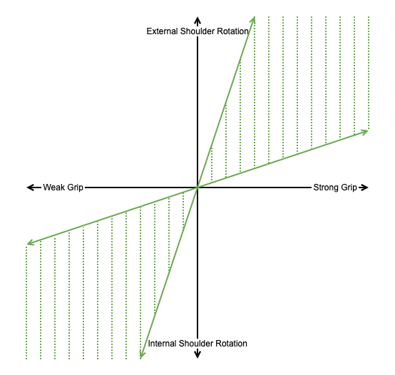
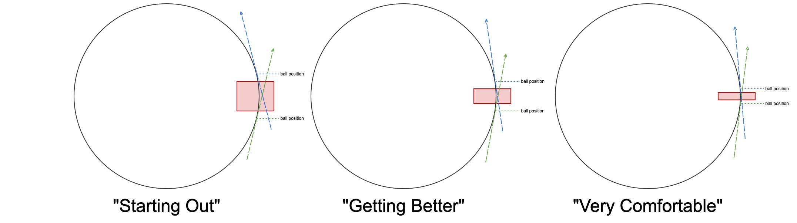
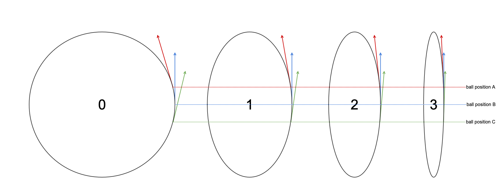

# Golf Notes

Anything related to understanding golf (swing or otherwise)

## Yardages

```
┌─────────────┬──────────────┬────────────┐
│ Avg_Yardage ┆ Club         ┆ Swing_Type │
│ ---         ┆ ---          ┆ ---        │
│ f64         ┆ str          ┆ str        │
╞═════════════╪══════════════╪════════════╡
│ 42.0        ┆ 60 deg Wedge ┆ 45 deg     │
├╌╌╌╌╌╌╌╌╌╌╌╌╌┼╌╌╌╌╌╌╌╌╌╌╌╌╌╌┼╌╌╌╌╌╌╌╌╌╌╌╌┤
│ 56.0        ┆ 60 deg Wedge ┆ 90 deg     │
├╌╌╌╌╌╌╌╌╌╌╌╌╌┼╌╌╌╌╌╌╌╌╌╌╌╌╌╌┼╌╌╌╌╌╌╌╌╌╌╌╌┤
│ 63.0        ┆ 52 deg Wedge ┆ 45 deg     │
├╌╌╌╌╌╌╌╌╌╌╌╌╌┼╌╌╌╌╌╌╌╌╌╌╌╌╌╌┼╌╌╌╌╌╌╌╌╌╌╌╌┤
│ 84.0        ┆ P Wedge      ┆ 45 deg     │
├╌╌╌╌╌╌╌╌╌╌╌╌╌┼╌╌╌╌╌╌╌╌╌╌╌╌╌╌┼╌╌╌╌╌╌╌╌╌╌╌╌┤
│ 89.0        ┆ 52 deg Wedge ┆ 90 deg     │
├╌╌╌╌╌╌╌╌╌╌╌╌╌┼╌╌╌╌╌╌╌╌╌╌╌╌╌╌┼╌╌╌╌╌╌╌╌╌╌╌╌┤
│ 122.0       ┆ P Wedge      ┆ 90 deg     │
└─────────────┴──────────────┴────────────┘
```


## Grip Thoughts

* quadrant 1: Non 100%, "control the wrist" shots (e.g. pitch shots)
* quadrant 3: 100%, "free the wrist" shots



## Swing Thoughts

**"Down the Line" Club Plane Differences:**
* The angle between your forearm and the shaft of the club should become smaller as you move from shorter clubs to
  longer clubs; *adjust your grip accordingly.*
* The angle between the swing plane and your torso plane *should vary* as you move from shorter clubs to longer clubs.
* The angle between the swing plane and your torso *can feel like < 90 degrees* for longer clubs (e.g. 5 iron and
  longer).
* If you are consistently hitting it fat with longer clubs, *it could just be that you need to move the bar further away
  from you and flatten the swing plane.*


### Birds Eye View - Swing Plane

**Different Ball Position == Different Shot Shapes**
* "Bend it a lot in order to learn out to bend it a little"
    * Consider the red part of the swing plane the "No Fly" zone; the spot in the swing where you *shouldn't* be
      positioning the ball. As you get better, this will/can become smaller (to produce smaller fades/draws) but it is
      best to start out with a large margin of safety.



**Vertical Swing Plane == Smaller Misses** 
* The ball travels in 3D space, yet *most* big misses are in the horizontal plane. A more vertical swing plane is  
  geometrically less likely to have large misses.

$$
\text{Let } \theta_i \text{ represent the angle between the forward ball position (red) and the back ball position (green):} \\
\\
\theta_{0} > \theta_{1} > \theta_{2} > \theta_{3}
$$



## Small Thoughts

* **(2022-07-20)**: Pitch Shots
    * On uphill lies, use your hands more and be stronger with it.
* **(2022-07-07)**: Tee Shots
    * Use a ball with lines and use the lines on the ball as a visual cue to help define the plane on which the club and
      your shoulders should rotate (flatter).

